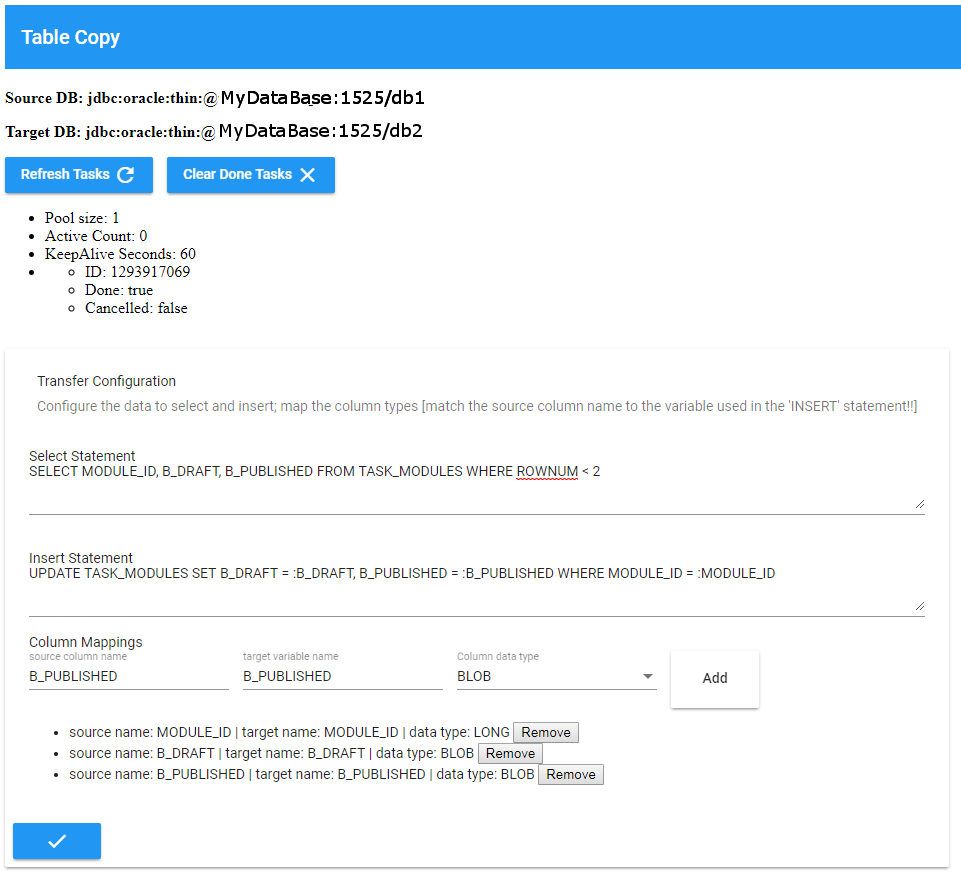

# TableCopy

This project was generated with [Angular CLI](https://github.com/angular/angular-cli) version 1.4.2. and Spring Boot version 1.5.9.RELEASE  

* Important  
Only the HSQL driver is included. You must either add your DB driver as a dependency and build the project from source, OR add your DB driver to the class path.  

## Running the app  
After building the app or downloading a prebuilt version, add an `application.properties` file to the same folder as the built jar file.  
Customize the application.properties to use your DB locations.  
Run the app with `java -jar table-copy-x.x.x.jar`  

See [Spring Boot](https://docs.spring.io/spring-boot/docs/current/reference/html/boot-features-external-config.html#boot-features-external-config-application-property-files) for more details on customizing the application properties.  
See the [application.properties](./src/main/resources/application.properties) for an example.  

  

## Development server
Run `mvn clean install` or `npm install` to install the client side dependencies.  
Run `mvn spring-boot:run` to start the java rest services on port 8080   
Run `npm run start-proxy` for a client side dev server that will proxy the rest calls to the java app on port 8080. Navigate to `http://localhost:4200/`. The app will automatically reload if you change any of the source files.

## Build

Run `mvn clean package` to build the project. The build artifacts will be stored in the `target/` directory.

## Running unit tests

Run `mvn test` to execute the unit tests via [Karma](https://karma-runner.github.io) and JUnit

## Running end-to-end tests

Run `ng e2e` to execute the end-to-end tests via [Protractor](http://www.protractortest.org/).
Before running the tests make sure you are serving the app via `ng serve`.

